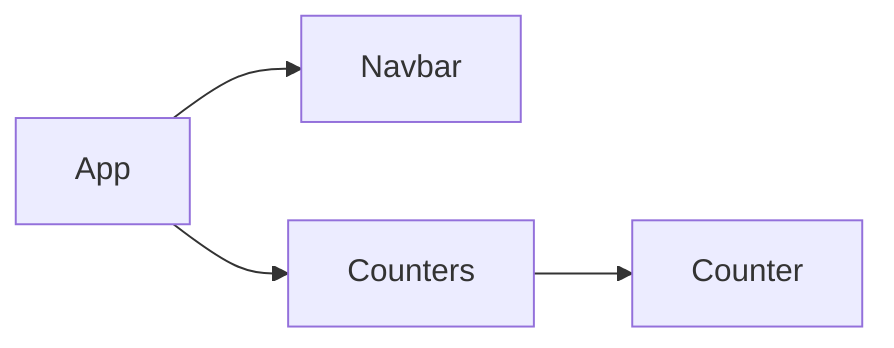

# Day 04 - Composing Components
## 01. Introduction
###
- Pass Data: how to pass the data between your components
- Raise and Handle Events: how to raise and handle events
- Multiple Components in Sync: how to have multiple components that are in sync
- Functional Components
- Lifecycle Hooks

## 02. Composing Components
###
```
class Counters extends Component {
  state = {
    counters: [
      { id: 1, value: 0, },
      { id: 2, value: 0, },
      { id: 3, value: 0, },
      { id: 4, value: 0, },
    ]
  }
  render() { 
    return (
      <div>
        { this.state.counters.map((counter) => <Counter key={counter.id}/>)}
      </div>
    );
  }
}
```

## 03. Passing Data to Components
###
- Every React component has a property called props that is plain JavaScript object, that includes all the attributes that we set in counters component.
```
<Counter key={counter.id} value={counter.value}/>
state = {
  count: this.props.value,
};
```

## 04. Passing Children
###
- The attributes that we set here are passed to our component using a single JavaScript object called props. We use it when we want to pass something between the opening and closing
- props.children: pass complex elements to a child component such as a dialogue box
  ```
  return (
      <div>
        { this.state.counters.map(counter => (
          <Counter key={counter.id} value={counter.value}>
            <h4>this is props.children</h4>
            <h3>Counter ID: {counter.id}</h3>
          </Counter>
        ))}
      </div>
    );

    render() { 
      return (
        <div>
          {this.props.children}
        </div>
      );
    }
  ```

## 05. Debugging React Apps
### tools for debugging React application
- tab React: on this panel we can see the tree of our components.
- $r: type '$r' in console. we get the instance of our first counter component. We can work with the instance of any components on our page.

## 06. Props vs State
###
- props: data that we give to a component. props is read only. We should not modify the input. If you need to modify that input during the lifecycle of a component, then we need that input and put it in the state.
- state:data that is local or private to that component. Other components cannot access that state. It's completely internal to that component.

## 07. Raising and Handling Events
###
- The component that owns a piece of the state, should be the one modifying it.
- Raising event
    - We need to add a new method to our counters component, and pass a reference to that method via props to the counter component.
```
handleDeleteCounter = () => {
    console.log('onDelete event handler called');
  }

  render() { 
    return (
      <div>
        {this.state.counters.map(counter => (
          <Counter 
            key={counter.id} 
            value={counter.value} 
            id={counter.id} 
            onDelete={this.handleDeleteCounter}/>
        ))}
      </div>
    );
  }
```

## 08. Updating the State
###
- with parameter use arrow function
```
<button 
  className="btn btn-danger btn-sm m-2"
  onClick={() => this.props.onDelete(this.props.id)}>
  Delete
</button>
```
- update the state: in React we do not update the state directly, in other words, we are not going to remove a counter from the array, instead, we're going to create a new array without a given counter, and then call the setState method of our component, and let react update the state.
- create filtered new counters array
```
const counters = this.state.counters.filter(c => c.id !== counterId);
```
- override the counters property with the counters
```
this.setState({
  counters
})
```
- encapsulate related values
```
{this.state.counters.map(counter => (
  <Counter 
    key={counter.id} 
    value={counter.value} 
    id={counter.id} 
    onDelete={this.handleDeleteCounter}/>
))}
```
```
<div>
  {this.state.counters.map(counter => (
    <Counter 
      key={counter.id} 
      counter={counter}
      onDelete={this.handleDeleteCounter}/>
  ))}
</div>
```

## 09. Single Source of Truth
###
- Add a reset button
```
{this.state.counters.map((counter) => {
  return <Counter 
    key={counter.id} 
    counter={counter}
    onDelete={this.handleDeleteCounter}/>
})}

{this.state.counters.map(counter => (
  <Counter 
    key={counter.id} 
    counter={counter}
    onDelete={this.handleDeleteCounter}/>
))}
```
```
handleResetCounters = () => {
  const counters = this.state.counters.map(function (counter){
    counter.value = 0;
    return counter;
  })
  this.setState({ counters })
}
```

## 10. Removing the local state
### Controlled component
- single source of truth: We need to remove the local state in our couunter component and have a single source of truth.
- Controlled component: It doesn't have it's own local state, it receives all the data via props and raises events whenever data needs to be changed. So this component is entirely controlled by it's parent.
- Change the counter component to controlled component
    - Delete local state
    - next, we need to find any references to this.state and update them accordingly. The first reference is in our handle increment method. 
    - Delete increment method.
    - change onclick event on button to raised event
```
onClick={() => this.props.onIncrement(this.props.counter)}
```
    - find all 'this.state.' expression and modify it. 
```
formatCount() {
  const { value } = this.props.counter;
  return value === 0 ? 'Zero' : value;
} 

getBadgeClasses() {
  let classes = "badge m-2 badge-";
  classes += this.props.counter.value ? "primary" : "warning";
  return classes;
}
```
    - Add a new event handler, increment method on counters component
```
handleIncrement = counter => {
  const counters = [...this.state.counters];
  const index = counters.indexOf(counter);
  counters[index].value++;
  this.setState({
    counters,
  })
};
```

## 11. Multiple Components in Sync
### Build navigation bar with total product numbers
- change the structure of application


## 12. Lifting the State Up
###
- Move state and method which are modify or mutate the state to App component
- Change all statements related with state in counters component
- raised events and state
```
<Counters
  counters={this.state.counters} 
  onReset={this.handleReset}
  onIncrement={this.handleIncrement}
  onDelete={this.handleDelete}
/>
```
- Total number in navigation bar
```
<NavBar totalCounters={this.state.counters.filter(count => count.value > 0).length}/>
```

## 13. Stateless Functional Components
###
- only have a single render method: don't have any event handlers, helper methods and state.
```
class NavBar extends Component {
  render() {
    return (
      <nav class="navbar navbar-light bg-light">
        <a class="navbar-brand" href="#">
          Navbar{" "}
          <span className="badge badge-pill badge-secondary">
            {this.props.totalCounters}
          </span>
        </a>
      </nav>
    );
  }
}
```
- in stateless function component we can't use this. So get props as parameters.
```
// Stateless Functional Component
const NavBar = (props) => {
  return (
    <nav class="navbar navbar-light bg-light">
      <a class="navbar-brand" href="#">
        Navbar{" "}
        <span className="badge badge-pill badge-secondary">
          {props.totalCounters}
        </span>
      </a>
    </nav>
  );
}

export default NavBar;
```

## 14. Destructuring Arguents
###
- Use object destructuring to destructure the props arguments
```
render() { 
    const { onReset, counters, onDelete, onIncrement } = this.props;
    return (
      <div>
        <button 
          className="btn btn-primary m-2"
          onClick={onReset}
          >Reset
        </button>
        {counters.map(counter => (
          <Counter 
            key={counter.id} 
            counter={counter}
            onDelete={onDelete}
            onIncrement={onIncrement}
          />
        ))}
      </div>
    );
  }
```
- We don't need to repeat "this.props"

## 15. Lifecycle Hooks
###
- Our components go through a few phases during their lifecycle.
- The first phase is the mounting phase: this is when an instance of a component is created and inserted into the DOM. There are a few special method that we can add to our components and React will automatically call these methods. We refer to these methods as lifecycle hooks. So they allow us to hook into certain moments during the lifecycle of a component and do something.
- In the mounting phase we have 3 lifecycle hooks, constructor, render and componentDidMount. React will call these methods in order. 
- The second lifecycle is the update phase, and this happens when the state, or the props of a component get changed. In this phase we have two lifecycle hooks, render and componentDidUpdate. So whenever we change the state of a component, or give it new props, these two methods are called in order.
- The last phase is the unmounting phase, and this is when a component is removed from the DOM such as when we delete the counter.

## 16. Mounting Phase
###
- The first life cycle hook: Constructor
- The consturctor is called once and it's the right place to initialize the properties in this calss. 
- The second life cycle hook: componentDidMount
- This method is called after our component is rendered into the DOM, and it's the perfect place to make AJAX calls, to get data from the server. An Ajax call and then call the set state with new data.
```
componentDidMount() {
  // Ajax Call
  this.setState({ movies})
}
```
- The third life cycle hook: render method
- rendered method is when a component is rendered all it's cildren are also rendered recursively.
- mounting phase priority: 1.Constructor 2.Rendered 3.Mounted

## 17. Updating Phase
###
- Update phase happens whenever the state or props of a component changes.
- entire component tree is rendered, that doesn't mean that the entire DOM is updated. When a component is rendered, we basically get a React element. So that is updating our virtual DOM. React will then look at the virtual DOM, it also has a copy of the old virtal DOM, that's why we should not update the state directly, so we can have two different object references in memory. we have the old virtual DOM as well as the new virtual DOM. Then React will figure out what has changed, and based on that it will update the real DOM accordingly.
- componentDidUpdate(): This method is called after a component is updated. Which means we have new state or new props, so we can compare this new state with the old state or the new props with the old props and if there's a change we can make an AJAX request to get new data from the server. If there are no changes perhaps we don't want to make an additional AJAX request, this is an optimization technique.
```
componentDidUpdate(prevProps, prevState) {
  console.log("prevProps", prevProps);
  console.log("prevState", prevState);
  if (prevProps.counter.value !== this.props.counter.value) {
    // Ajax call and get new data from the server
  }
}
```
- we can decide whether we should make an AJAX call to get new data based on the changes in props and state objects.

## 18. Unmounting Phase
### componentWillUnmount()
- this method called just before a component is removed from the DOM
- React will compare this virtual DOM with the old one, it figures out that one of our conuters is removed, so then it will call componentWillUnmount before removing this counter from the DOM.
- And this gives us an opportunity to do any kind of cleanup. So if you have set up timers, or listeners, we can clean those up before this component is removed from the DOM, otherwise we'll end up with memory leaks.
